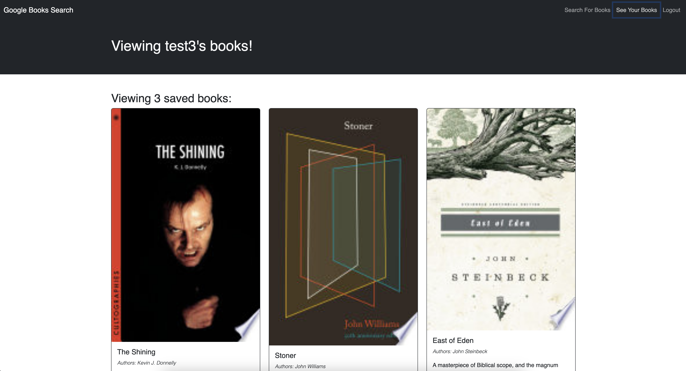

# Book Search Engine

## Table of Contents

- [Description](#description)
- [Instructions](#instructions)
- [Demonstration](#demonstration)
- [Technologies](#technologies)
- [Contributions](#contributions)
- [Questions](#questions)

## Description
In this challenge you'll take a fully functioning Google Books API search engine built with a RESTful API, and refactor it to be a GraphQL API built with Apollo Server. 

## Instructions
N/a

## Demonstrations
[Deployed Render Link](https://booksearch-hdpo.onrender.com)  

## Technologies
JavaScript/TypeScript
Google Books API
MongoDB

## Contributions
Boiler plate code used throughout Module 18, XPert Learning Assistant, and Tutor Alexis San Javier

## Questions 
If you have any additional questions about the project, please feel free to raach me at: 
- GitHub [jaornelas](https://github.com/jaornelas)
- E-Mail [ornelalf001@gmail.com](mailto:ornelalf001@gmail.com)
